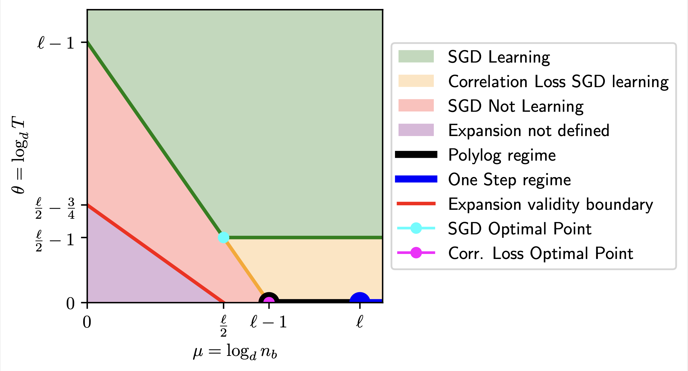

# Online Learning and Information Exponents: On The Importance of Batch size, and Time/Complexity Tradeoffs
<div width=auto>
    
</div>

> Phase diagram showing achievable time complexity for different batch sizes and algorithms. $\ell$ is the <i>information exponent</i> (or <i>leap index</i>) of the target.

### Installation
It requires Python 3.10 or later (not tested on Python later than 3.11). 
```
git submodule update --init --recursive # install boostmath
pip install -r requirements.txt
pip install -e giant-learning --no-binary :all:
```

### How to use
As the paper, our code is divided into two parts:
 - _Time Complexity Analysis at initialization_: This part is implemented in the notebook `time-complexity.ipynb`.
 - _Exact Asymptotic ODEs_: This part is implemented in the notebook `exact-asymptotic.ipynb`.

 ### Extra
 In the folder ```mathematica/``` you can find the Mathematica notebook used to derive the explicit ODEs for the exact asymptotic analysis. 